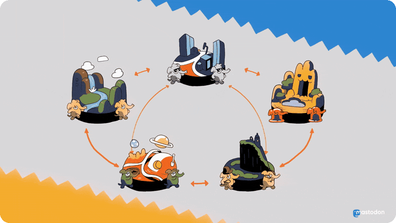

> [!NOTE]
> Want to learn more about Mastodon?
> Click below to find out more in a video.

<p align="center">
  <a style="text-decoration:none" href="https://www.youtube.com/watch?v=IPSbNdBmWKE">
    
  </a>
</p>

<p align="center">
  <a style="text-decoration:none" href="https://github.com/mastodon/mastodon/releases">
    </a>
  <a style="text-decoration:none" href="https://crowdin.com/project/mastodon">
    </a>
</p>

Mastodon is a **free, open-source social network server** based on [ActivityPub](https://www.w3.org/TR/activitypub/) where users can follow friends and discover new ones. On Mastodon, users can publish anything they want: links, pictures, text, and video. All Mastodon servers are interoperable as a federated network (users on one server can seamlessly communicate with users from another one, including non-Mastodon software that implements ActivityPub!)

> [!NOTE]
> This is a fork of Mastodon v4.5.9 with the Ruby on Rails backend replaced by a Python/FastAPI backend. The REST API, ActivityPub federation, and background workers are all implemented in Python. The React frontend and Node.js streaming server are unchanged.

## Navigation

- [Project homepage 🐘](https://joinmastodon.org)
- [Blog 📰](https://blog.joinmastodon.org)
- [Documentation 📚](https://docs.joinmastodon.org)

## Features


**Part of the Fediverse. Based on open standards, with no vendor lock-in.** - the network goes beyond just Mastodon; anything that implements ActivityPub is part of a broader social network known as [the Fediverse](https://jointhefediverse.net/).

**Real-time, chronological timeline updates** - updates of people you're following appear in real-time in the UI via the Node.js streaming server.

**Media attachments** - upload and view images and videos attached to the updates.

**Safety and moderation tools** - private posts, locked accounts, phrase filtering, muting, blocking, reporting, and moderation.

**OAuth2 and a straightforward REST API** - full OAuth2 provider with the Mastodon-compatible REST and Streaming APIs.

## Tech stack

| Component                     | Technology                                                                                                        |
| ----------------------------- | ----------------------------------------------------------------------------------------------------------------- |
| REST API + ActivityPub        | [FastAPI](https://fastapi.tiangolo.com/) (Python 3.12+)                                                           |
| Database                      | [PostgreSQL](https://www.postgresql.org/) 14+                                                                     |
| Cache + pub/sub               | [Redis](https://redis.io/) 7+                                                                                     |
| Background jobs               | [arq](https://arq-docs.helpmanual.io/) (async Redis queue)                                                        |
| Streaming API (WebSocket/SSE) | [Node.js](https://nodejs.org/) 20+                                                                                |
| Web UI                        | [React](https://reactjs.org/) + [Redux](https://redux.js.org/) + TypeScript, built with [Vite](https://vite.dev/) |
| Schema migrations             | [Alembic](https://alembic.sqlalchemy.org/)                                                                        |
| Reverse proxy                 | [nginx](https://nginx.org/)                                                                                       |

## Development

### Prerequisites

- [Docker](https://www.docker.com/) + Docker Compose (or [Podman](https://podman.io/) with `docker-compose`)
- **OR** for native dev: Python 3.12+, [uv](https://docs.astral.sh/uv/), Node.js 20+, PostgreSQL 14+, Redis 7+

### Quick start (Docker Compose)

```bash
# Clone and enter the repo
git clone <repo-url>
cd mastodon

# Build images and start the stack
docker compose build
docker compose up -d

# Run database migrations (first time only)
docker compose exec python uv run alembic upgrade head

# The API is now available at http://localhost:3000
curl http://localhost:3000/api/v1/instance
curl http://localhost:3000/_py/health
```

### Docker Compose services

| Service  | Description                            | Port            |
| -------- | -------------------------------------- | --------------- |
| `proxy`  | nginx reverse proxy (entry point)      | 3000            |
| `python` | FastAPI/uvicorn with hot-reload        | 8000 (internal) |
| `arq`    | Async background worker                | —               |
| `stream` | Node.js WebSocket/SSE streaming server | 4000 (internal) |
| `vite`   | Frontend dev server                    | 3036            |
| `db`     | PostgreSQL 14                          | 5432 (internal) |
| `redis`  | Redis 7                                | 6379 (internal) |

```bash
docker compose ps              # check service status
docker compose logs -f         # follow all logs
docker compose logs -f python  # FastAPI logs only
docker compose down            # stop all services
docker compose down -v         # stop + delete volumes
```

### Native dev (without Docker)

```bash
# Install Python deps
uv sync

# Install JS deps
yarn install

# Run migrations
uv run alembic upgrade head

# Start all processes
bin/dev   # uses honcho (installed via uv) or overmind if available
```

`bin/dev` starts: FastAPI (`:8000`), arq, Node.js streaming (`:4000`), Vite, and nginx proxy (`:3000`).

### Running tests

```bash
# Python (pytest)
uv run pytest
uv run pytest tests/routers/test_statuses.py   # single file
uv run pytest -k "timeline"                    # filter by keyword

# JavaScript/TypeScript (Vitest)
yarn test:js run
yarn test:js run path/to/file.test.ts

# Type checking
uv run mypy app/python
yarn typecheck

# Linting
uv run ruff check app/python
yarn lint
```

### Database migrations

```bash
# Apply pending migrations
uv run alembic upgrade head

# Generate a new migration from model changes
uv run alembic revision --autogenerate -m "describe the change"

# Downgrade one step
uv run alembic downgrade -1
```

### Project layout

```
app/python/          FastAPI backend
  main.py            App factory + lifespan
  settings.py        Config (reads DB_*, REDIS_*, etc. env vars)
  db.py              Async SQLAlchemy engine + session
  deps.py            FastAPI dependency injection
  routers/           API endpoint handlers (one file per resource)
  models/            SQLAlchemy ORM models
  schemas/           Pydantic request/response schemas
  services/          Business logic
  workers/           arq background workers
  federation/        ActivityPub + HTTP signatures
  auth/              OAuth2 + token resolution
  policies/          Visibility / authorization checks
  common/            Shared utilities (snowflake IDs, pagination, etc.)
  lib/               HTML sanitization, hashtag/mention extraction
alembic/             Database migrations
  env.py             Alembic environment (imports all models)
  versions/          Migration files
tests/               pytest test suite
  routers/           API endpoint tests
  federation/        ActivityPub tests
  auth/              Auth tests
  common/            Utility tests
app/javascript/      React + Redux frontend (unchanged from upstream)
streaming/           Node.js WebSocket/SSE streaming server (unchanged)
config/nginx/
  dev.conf           nginx config for native dev (upstream: 127.0.0.1)
  docker.conf        nginx config for Docker Compose (upstream: service names)
Dockerfile.python    Docker image for FastAPI + arq
docker-compose.yml   Full dev stack
```

## Configuration

The Python app reads configuration from environment variables (with `.env.development` as fallback for local dev). Key variables:

| Variable          | Default                | Description              |
| ----------------- | ---------------------- | ------------------------ |
| `MASTODON_ENV`    | `development`          | Runtime environment      |
| `DB_HOST`         | `localhost`            | PostgreSQL host          |
| `DB_PORT`         | `5432`                 | PostgreSQL port          |
| `DB_USER`         | `mastodon`             | PostgreSQL user          |
| `DB_PASS`         | _(empty)_              | PostgreSQL password      |
| `DB_NAME`         | `mastodon_development` | PostgreSQL database      |
| `REDIS_HOST`      | `localhost`            | Redis host               |
| `REDIS_PORT`      | `6379`                 | Redis port               |
| `LOCAL_DOMAIN`    | `localhost:3000`       | Instance domain          |
| `SECRET_KEY_BASE` | _(empty)_              | Secret for token signing |
| `S3_ENABLED`      | `false`                | Use S3 for media storage |

## Contributing

Mastodon is **free, open-source software** licensed under **AGPLv3**.

You should read and understand the [CODE OF CONDUCT](https://github.com/mastodon/.github/blob/main/CODE_OF_CONDUCT.md).

AI-assisted contributions are governed by the project's [AI Contribution Policy](https://github.com/mastodon/.github/blob/main/AI_POLICY.md).

## LICENSE

Copyright (c) 2016-2025 Eugen Rochko (+ [`mastodon authors`](AUTHORS.md))

Licensed under GNU Affero General Public License as stated in the [LICENSE](LICENSE):

```text
Copyright (c) 2016-2025 Eugen Rochko & other Mastodon contributors

This program is free software: you can redistribute it and/or modify it under
the terms of the GNU Affero General Public License as published by the Free
Software Foundation, either version 3 of the License, or (at your option) any
later version.

This program is distributed in the hope that it will be useful, but WITHOUT
ANY WARRANTY; without even the implied warranty of MERCHANTABILITY or FITNESS
FOR A PARTICULAR PURPOSE. See the GNU Affero General Public License for more
details.

You should have received a copy of the GNU Affero General Public License along
with this program. If not, see https://www.gnu.org/licenses/
```
